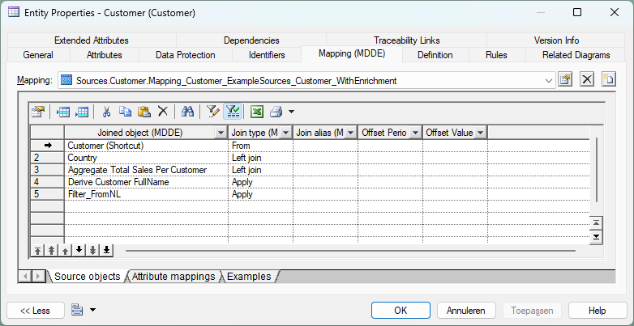

# PowerDesigner-MDDE-Extension

PowerDesigner Project and LDM extensions to support Model Driven Data Engineering using PowerDesigner LDM models.

- [Introduction](#introduction)
- [Getting started](#getting-started)
- [Manual](#manual)
- [Contributing](#contributing)

## Introduction

This repository contains several PowerDesigner extensions. These are described below.

### LDM modeling extension

These LDM extension add additional modeling capabilities to PowerDesigner. These extra modeling options are listed below per object type.

- Entity
  - Mapping
    - Custom source objects tab on mappings.
      - To support using the same source object twice in a mapping in a different  role.
      - To specify join type and conditions on source objects.
      - To specify period offsets on source objects (for example last month).
    - Examples tab on mappings so example input and output data can be specified in the model.

    

  - Business rule (stereotype)
    - Add support for modeling business rules with input/output attributes and examples.
    - Supported sub-stereotypes:
      - Filter business rule
      - Scalar business rule
      - Custom business rule
      - Aggregate business rule
      - Pivot business rule

      

- Model checks
  - Extra model checks have been implemented to verify the newly supported objects.
- PowerDeComposer integration
  - To allow version management of PowerDesigner files in Git the tool [PowerDeComposer](https://github.com/CrossBreezeNL/PowerDeComposer) have been implemented. In this extension a menu item on models have been added to decompose a model using PowerDeComposer.
- XML export
  - To generate code, tests, etc. using [CrossGenerate](https://github.com/CrossBreezeNL/CrossGenerate) for the model an XML export has been implemented on model level.

In many cases it is helpful to customize the XML Export to include project-specific extensions. The MDDE Model Export Extension can be used to include this type of project-specific model content in the MDDE XML Export without modifying the MDDE extension.

### LDM export extension

To extend the XML export part of the [LDM modeling extension](#ldm-modeling-extension), this extension is a bootstrap file which can be extended by end-users to add any needed metadata into the XML export.

### Project extension

The project extension can be used when you have a project with multiple logical data models to ease the modeling workflow. The extension enables, amongst other things, to open all models at once or decompose and export all open models with one click.

## Getting started

These prerequisites are needed when you want to start using the extension(s).

- PowerDesigner 16.6 or higher.

In order to get started with the extension(s), perform the following steps:

1. Download the MDDE Extension(s) from the latest [release](https://github.com/CrossBreezeNL/PowerDesigner-MDDE-Extension/releases/).
1. Attach the extension(s) to an existing or new Logical Data Model in PowerDesigner. Instructions can be found [here](./manual/FAQs.md#how-do-i-attach-a-powerdesigner-extension-to-a-model).
1. Start using the extension. Consult the modeling [manual](./manual/README.md) for instructions.

## Manual

There is a manual available [here](./manual/README.md) on how to use the PowerDesigner extensions.

## Contributing

Contribution are very welcome. Please read the page on contributions [here](./CONTRIBUTING.md).