> [Manual](./README.md) > Business rule

# Business rule

In order to model business rules new object types are introduced using the extension (based on the Entity type). If you are in a diagram of a model where the 'Data Warehouse Automation' extensions is attached, in the Toolbox on the right a section for this extension will be available for creating business rules.

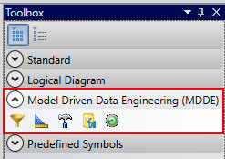

In order to create a business rule you can click on any business rule icon in the Toolbox in the 'Data Warehouse Automation (MDDE)' section. Hover over the icon to see what each icon represents. When you have clicked an icon the Toolbox you can click in the diagram where you want to have the business rule positioned. To stop creating business rules in the diagram, press the right-click button of the mouse. After you have create a scalar business rule in the diagram you can double click to edit it. Specifics about each business rule type are explained in their respective section:

## Scalar business rule

A scalar business rule is a business rule which can have one or more inputs (parameters) and only one output. These types of business rules are idempotent, meaning that it will always return the same result given identical input. This also means these types of business rules don't consume any more input then it's input attributes. Furthermore the logic of the business rule is functionally described and technically implemented using a SQL expression.

Go through the following steps to model the scalar business rule:

### General

On the 'General' tab:

1. Set the Name of the scalar business rule. This must be a short functional name which makes clear what the purpose of the rule is. The Code of the rule is automatically populated based on the Name you have entered.
1. Functionally describe the business rule in the 'Comment' field.
1. Write the SQL syntax for the business rule in the 'SQL Expression (MDDE)' field. The expression should contain one or multiple scalar SQL expressions seperated by a comma. For example `CASE WHEN ... THEN ... ELSE ... END AS EXAMPLE_OUTPUT` or `LEFT(..., ...) AS LEFT_OUTPUT`. Don't include any set operation like SELECT, JOIN, GROUP BY or somesort. You must include the output alias of the expression (like ` AS RESULTING_VALUE`) the output alias must match the 'Code' of an attribute of the business rule with the stereotype 'Output attribute (MDDE)'. When you want to reference an input of the business rule in the SQL expression you must use the 'Code' of the input attribute as specified on the 'Attributes' tab (see below for explanation on adding these attributes). For example, when you have an input attribute with the Name 'First Name' it's Code will be 'FIRST_NAME' and an example SQL expression can be `FIRST_NAME || ' ' || LAST_NAME AS FULL_NAME`.

> Preferably use ANSI SQL syntax since it makes the expression re-usable when migrating to a different database platform.

### Attributes

On the 'Attributes' tab:
1. Add each input of the rule as an attribute, set it's data type and set the Stereotype to 'Input attribute (MDDE)'
1. Add the output of the rule as an attribute, set it's data type and set the Stereotype to 'Output attribute (MDDE)'

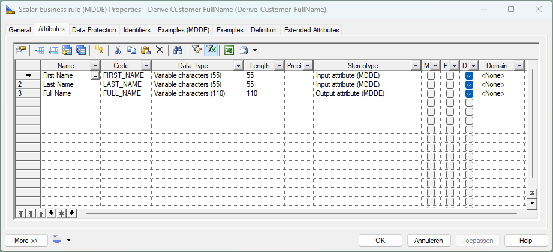

> Note: the name of the input and output attributes need to be functional so it's clear what input is expected and what the output means.

> If you don't see the 'Stereotype' field in the Attributes list, you can add it using the 'Customize Columns and Filter' toolbar button.

### Examples

As part of specifying business rules it's important to also include examples. An example contains the expected output given an example input for the scalar business rule. To model an example following the following steps:

On the 'Examples (MDDE)' tab:
1. Click on the 'Add example' button. This will create a new empty example and pre-populate the input and output lists with the attributes modelled in the scalar business rule.
2. Set the 'Name' of the example so it's clear what scenario it resembles.
3. Set the values for the input attributes in the 'Input' section.
4. Set the values for the expected output in the 'Output' section.
5. (Optionally) Descrive the scenario in the 'Comment' field.
6. Press 'Apply' to store the scenario.

When you want to create multiple examples, follow the the above steps for every example.

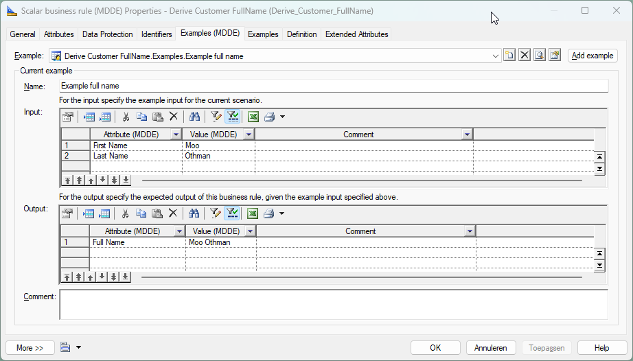

## Filter business rule

A filter business rule is a rule with which one can filter a dataset from within a mapping. It can have one or more inputs and it should contain a Sql Expression which can be evaluated as a condition (boolean). Only records from the mapping where the result of the expression is true will be returned.

> A filter business rule can only be applied on the whole resultset of a mapping. This means it can't be used to filter a single source object within a mapping. For the latter the filter condition should be part of the source object join conditions.

Go through the following steps to model the filter business rule:

### General

On the 'General' tab:

1. Set the Name of the filter business rule. This must be a short functional name which makes clear what the purpose of the filter is. The Code of the rule is automatically populated based on the Name you have entered.
1. Functionally describe the business rule in the 'Comment' field.
1. Write the SQL syntax for the filter in the 'SQL Expression (MDDE)' field. The expression should contain one SQL condition (it should be true or false). For example `FIRST_INPUT > SECOND_INPUT` or `FIRST_INPUT <> SECOND_INPUT AND FIRST_INPUT > 0`. Don't include any set operation like SELECT, JOIN, GROUP BY or somesort. Also don't include the output alias of the expression (like ` AS RESULTING_VALUE`). When you want to reference an input of the business rule in the SQL expression you must use the 'Code' of the input attribute as specified on the 'Attributes' tab (see below for explanation on adding these attributes). For example, when you have an input attribute with the Name 'Contry Code' it's Code will be 'COUNTRY_CODE'.

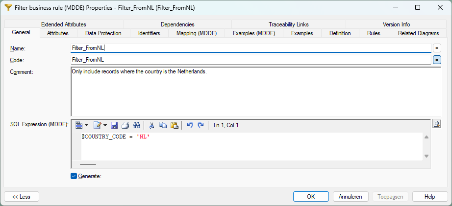

### Attributes

On the 'Attributes' tab:
1. Add each input of the rule as an attribute, set it's data type and set the Stereotype to 'Input attribute (MDDE)'

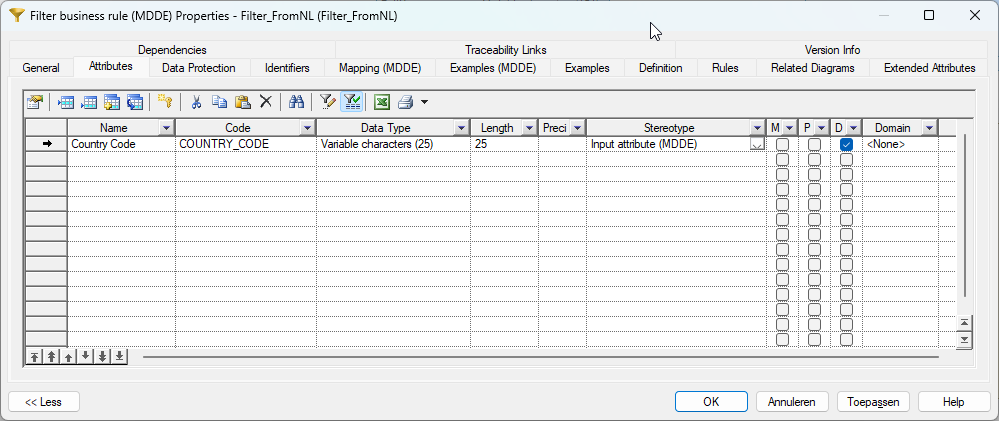

### Examples

As part of specifying business rules it's import to also include examples. An example contains the expected filter result given an example input for the filter business rule. To model an example following the following steps:

On the 'Examples (MDDE)' tab:
1. Click on the 'Add example' button. This will create a new empty example and pre-populate the input lists with the attributes modelled in the filter business rule.
2. Set the 'Name' of the example so it's clear what scenario it resembles.
3. Set the values for the input attributes in the 'Input' section.
4. Set the value for the expected filter result in the 'Output' section. 'Yes' means the record will be included and 'No' means the records will be excluded from the resultset when applying the filter.
5. (Optionally) Descrive the scenario in the 'Comment' field.
6. Press 'Apply' to store the scenario.

When you want to create multiple examples, follow the the above steps for every example.

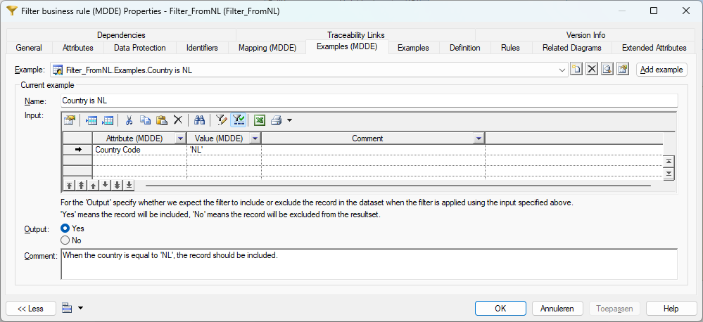

## Aggregate business rule
The aggregate business rule can be used to aggregate data from one or multiple sources. This rule is modelled like a normal entity, also supporting modelling mappings on the entity. The only difference is that a 'Aggregate' method can be specified on a mapped attribute where the target attribute is not part of the primary identifier (since the data is grouped on the identifier attributes).

Go through the following steps to model the aggregate business rule:

### General

On the 'General' tab:

1. Set the Name of the aggregate business rule. This must be a short functional name which makes clear what the purpose of the rule is. The Code of the rule is automatically populated based on the Name you have entered.
1. Functionally describe the business rule in the 'Comment' field.

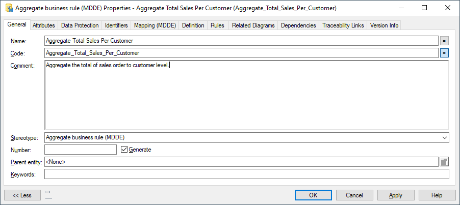

### Attributes

On the 'Attributes' tab:
1. Add the output of the rule as attributes and set the data types. Also tick the 'Primary Identifier' boxes for the identifying attributes. These identifying attributes are used to group the mapped dataset on.

### Mappings

On the mappings tab of the business rule you can add one or more mappings to the aggregate business rule. Each mapping adds a subset to the output of the aggregate rule where the aggregation is applied for each mapping seperately. Mappings are created exactly the same as for normal entities, with one addition where the aggregate function needs to be specified for each mapped non-identifying attribute. Follow the steps below to create the mapping.

1. To create a mapping with examples, please follow the standard [Mapping](./Mapping.md) instructions.
1. When the mapping is modeled you can specify the aggregate method for each mapped attribute in the 'Aggregate (MDDE)' field for each non-identifying attribute on the 'Attribute mappings' tab.

   > Make sure the column 'Aggregate (MDDE)' is visible. If not, you can add them using the 'Customize Columns and Filter' toolbar button.

## Pivot business rule
The pivot business rule can be used to pivot data from one or multiple sources. This rule is modelled like a normal entity, also supporting modelling mappings on the entity. The only difference is that on a mapping the pivot configuration needs to be modelled.

Go through the following steps to model the pivot business rule:

### General

On the 'General' tab:

1. Set the Name of the pivot business rule. This must be a short functional name which makes clear what the purpose of the rule is. The Code of the rule is automatically populated based on the Name you have entered.
1. Functionally describe the business rule in the 'Comment' field.

### Attributes

On the 'Attributes' tab:
1. Add the output of the rule as attributes and set the data types. Also tick the 'Primary Identifier' boxes for the identifying attributes. For the pivot business rule the output attributes are the expected output attributes of the pivot operation.

> It's recommended not to specify output attributes of the pivot operation as primary identifiers, since it is very likely that these columns will not always be populated.

### Mappings

On the mappings tab of the business rule you can add one or more mappings to the pivot business rule. Each mapping adds a subset to the output of the pivot rule where the pivot operation is applied for each mapping separately. Mappings are created exactly the same as for normal entities, with one additional tab where the pivot configuration needs to be specified for each mapping. Follow the steps below to create the mapping.

1. To create a mapping with examples, please follow the standard [Mapping](./Mapping.md) instructions.
   > Only create attribute mappings here for attributes which are sources directly from the source objects. The attributes which are the result of the pivot operation are mapped in step 3 (using the 'Pivot Target Attributes' tab).

   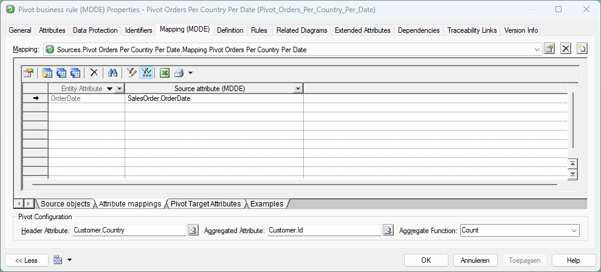

   In our example only the 'OrderDate' is in the attribute mapping. The other attributes which we modelled on the attributes tab ('NLD', 'DEU' and 'FRA') are the result of the pivot operation, and thus cannot be sourced directly from a source object.
1. When the mapping is modeled you can specify the header attribute, aggregated attribute and aggregate function in the 'Pivot Configuration' section at the bottom of the mapping deails.
   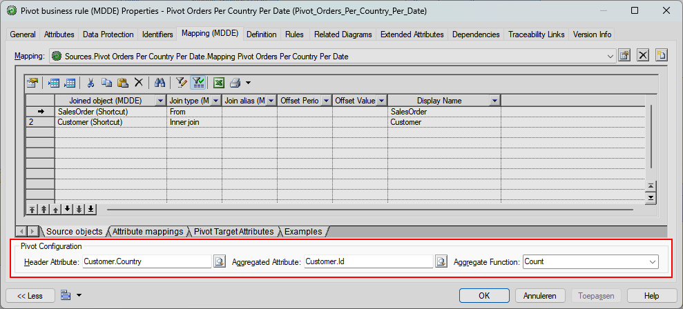
   - The *header attribute* is the attribute which contains the values to be translated to new attributes during the pivot operation.
   - The *aggregated attribute* is the attribute which contains the values to be aggregated during the pivot operation.
   - The *aggregate function* is the function to use on the aggregated attribute during the pivot operation.
1. On the 'Pivot Target Attributes' tab of the mapping the translation from the header attribute values to the target attribute of the pivot entity must be configured. Make sure to list each header attribute value which needs to be translated during the pivot operation. Store the value in the 'Name' field and select the target attribute in the 'Target Attribute (MDDE)' field.
   

   In the example above, when in the input 'Customer.Country' attribute the value is 'Netherlands' the output of the Count(Customer.Id) operation will be stored in the 'NLD' attribute of the pivot output.

## Custom business rule

> This business rule doesn't provide/guarantee attribute and entity level lineage. The custom business rule should only be used for constructs that are not (yet) supported otherwise in this modeling extension.

A custom business rule is a business rule that can have one or more mappings with each it's own expression. This type of business rule is a fall-back component for when there is no business rule type available for your needs. Ideally it shouldn't be used, because this type of business rule is not providing any attribute level lineage (it does provide entity level lineage, but it's not guaranteed to be correct). The logic of the business rule is functionally described and technically implemented using a SQL expression in a mapping.

Go through the following steps to model the custom business rule:

### General

On the 'General' tab:

1. Set the Name of the custom business rule. This must be a short functional name which makes clear what the purpose of the rule is. The Code of the rule is automatically populated based on the Name you have entered.
1. Functionally describe the business rule in the 'Comment' field.

### Attributes

On the 'Attributes' tab:
1. Add the output of the rule as attributes and set the data types. Also tick the 'Primary Identifier' boxes for the identifying attributes.

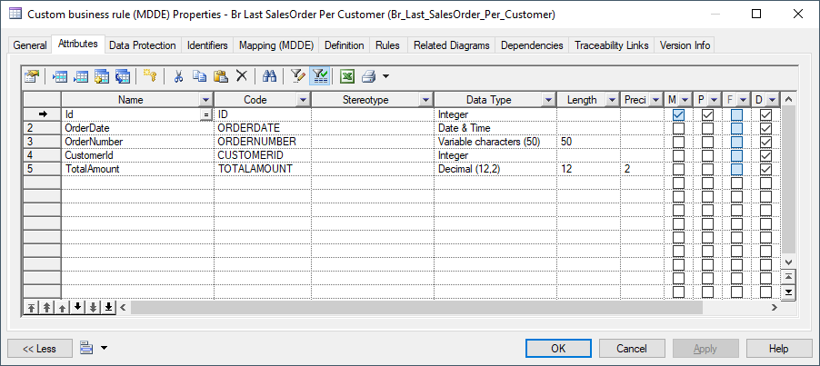

### Mappings

On the mappings tab of the business rule you can add one or more mappings to the custom business rule. Each mapping adds a subset to the output of the rule. For every mapping the source objects need to be specified, so the SQL can be semi-validated and examples can be modelled.
These mappings deviate from normal mappings a bit. Custom business rule mappings don't have an 'Attribute mappings' tab, but a 'Mapping expression' tab where you can specify the Sql Expression for the current mapping.

1. To create a mapping, please follow the standard [Create a mapping](./Mapping.md#create-a-mapping) instructions.
1. To add source objects, please follow the standard [Add source object](./Mapping.md#add-a-source-object) instructions. You don't have to specify the join conditions.
 As mentioned above you cannot add attribute mappings, so you can skip these instructions and go to the steps below.
   
1. Write the SQL syntax for the custom business rule in the 'SQL Expression (MDDE)' field on the 'Mapping expression' tab. The expression should contain a full SQL statement starting with SELECT. Also include any set operation like JOIN, GROUP BY or somesort where needed. It is up to the modeler to make sure that the output definition of the SQL Expression is in line with the attribute definition that is defined on the entity.
   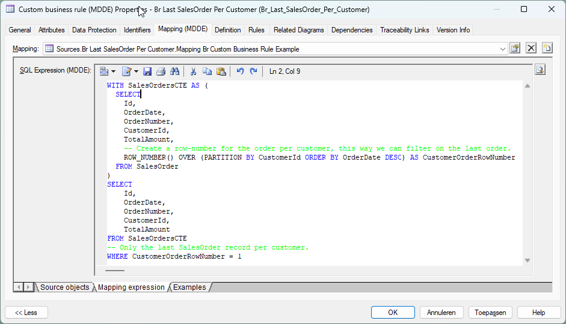
   > Preferably use ANSI SQL syntax since it makes the expression re-usable when migrating to a different database platform.
1. To add examples for the mapping, please follow the standard [Examples](./Mapping.md#examples) instructions.
   

***

[Go back to main modeling page](./README.md)