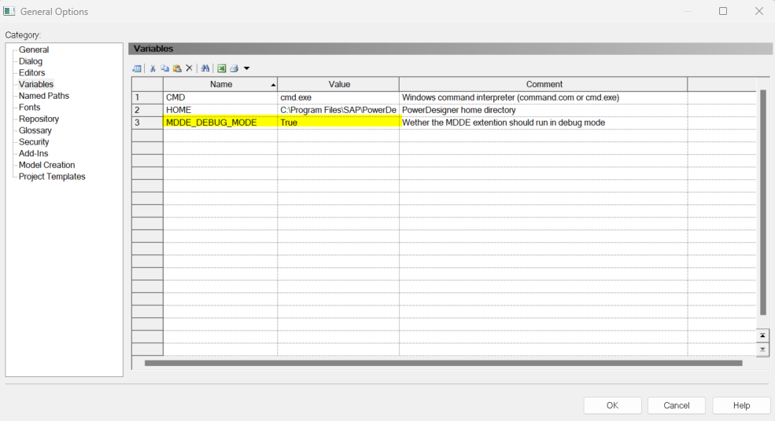

> [Modeling](./README.md) > Frequently asked questions

# Frequently asked questions

## How do I attach a PowerDesigner extension to a model?

To attach an extension to an existing PowerDesigner model, 2 steps need to be taken.
1. Setup the [XEM] named path in PowerDesigner so the folder where the extension is stored is added to the path. Make sure to leave the existing paths in the [XEM] named path in place. The instructions can be found [here](https://help.sap.com/docs/SAP_POWERDESIGNER/abd3434b4987485c92057ab9392aadbe/c7e182f46e1b1014a4c38d524df99995.html).
2. Attach an extension to an existing PowerDesigner model. The instructions can be found [here](https://help.sap.com/docs/SAP_POWERDESIGNER/31c48596e34446a68956e0aa7e700a2e/c7e1ddda6e1b101482c096290e45387b.html).

## Why don't I see the tab mentioned in the manual?

If you don't see a certain tab on an object, click on the 'More >>' button in the bottom left of the object dialog (the button is '<< Less' if the tab is already visible).

## How can I add a certain property to a table grid?

When you are in a screen where you can edit a list of data (in a table grid) you can add properties using the 'Customize Columns and Filter' toolbar button.

## How can I import an LDM from a database?

In order to create an LDM from a database, we first need to reverse engineer a physical data model (PDM) from the database and then generate/update the logical data model (LDM) from the PDM.

The first step, reverse engineering a PDM from a database, can either be from a live database connection or SQL scripts. For instructions choose one of the links below:
- [Reverse engineering a PDM from a live database](https://help.sap.com/docs/SAP_POWERDESIGNER/856348b84a7c479489d5172a630f014d/c7cbc2a36e1b10149b25d0a193caf56c.html)
- [Reverse engineering a PDM from a script](https://help.sap.com/docs/SAP_POWERDESIGNER/856348b84a7c479489d5172a630f014d/c7cbaea46e1b1014a962e24470da14db.html)

The second step, generate/update LDM from PDM, can be done with the instructions below:
- [Generating a LDM from an PDM](https://help.sap.com/docs/SAP_POWERDESIGNER/856348b84a7c479489d5172a630f014d/c7c994ac6e1b1014a7cee7aac852831e.html?locale=en-US)

## I get a confirmation dialog to commit changes, what to do?

Sometimes a dialog screen pops up with the question whether you want to commit, like in the image below:

When this is asked, choose 'Yes'.

> This problem can also be solved by changing a generic PowerDesigner setting by performing the following steps:
> 1. Go to 'Tools' in the main menu and choose 'General Options...'
> 1. In the 'General Options' screen go to the 'Dialog' section.
> 1. For the 'Operating modus' enable 'Auto commit'.
>
> Note that the 'OK', 'Cancel' and 'Apply' buttons will disappear from every screen and a 'Close' button will appear. Reverting a change can be done using the 'Undo' functionaly (Edit -> Undo or CTRL+Z).

## Is there a way to debug the extension?

When developing the extension we added writing extra debugging information to the 'Script' output window. This debugging information is only writting to the output when MDDE_DEBUG_MODE is enabled. To enable/disable debug mode, please follow the following steps:

1. Go to 'Tools' in the main menu and choose 'General Options...'.
1. In the 'General Options' screen go to the 'Variables' section.
1. Add a new variable with the name 'MDDE_DEBUG_MODE' (if it doesn't exist yet).
1. Set the 'Value' for this variable to 'True' when you want debug mode enabled or the 'False' when you want it disabled. If the variable doesn't exist debug mode will be disabled by default.

[Go back to main modeling page](./README.md)
