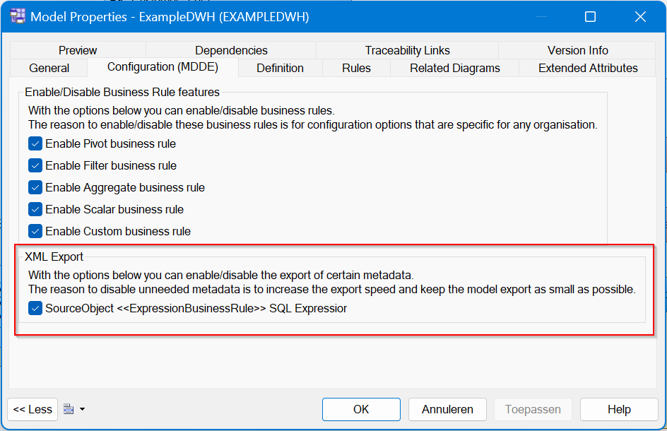
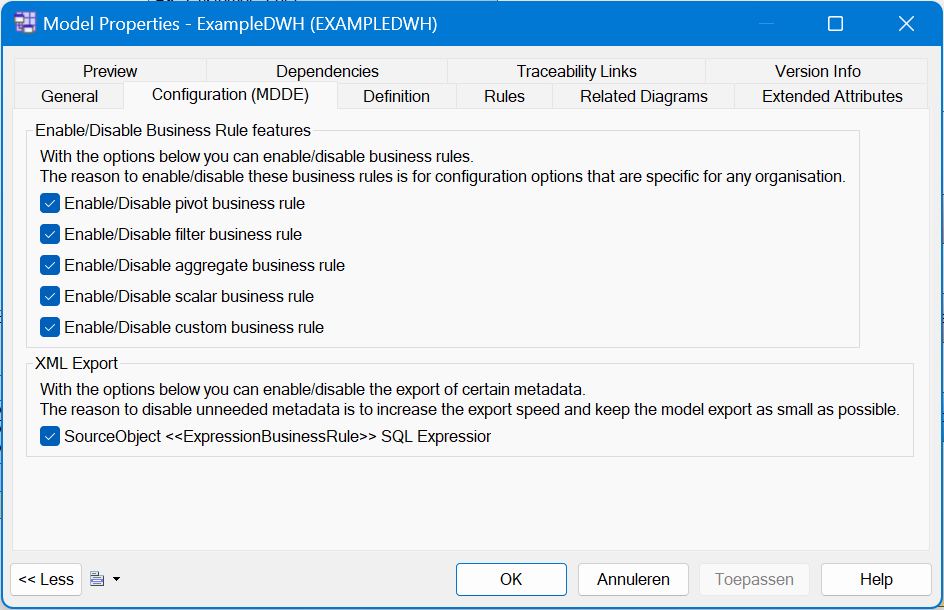

> [Manual](./README.md) > Configure the XML export

# MDDE Model Configuration
This file describes all the possible configuration settings that can be changed at model level. These possibilities include a XML export of the MDDE extension and enabling/disabling the business rules.

## XML Export

The XML export of the MDDE extension can be configured to include/exclude certain information. These configuration properties are available on model level. You can access the configuration by right-clicking on the model, and click on 'Properties'. In the new dialog window go the the 'Configuration (MDDE)' tab.

On this tab you can tick the boxes for the metadata which you want to include in the XML export.

> **Note**:
> If you have multiple models and want to keep these settings in sync, it's adviced to create a model check for your project/organisation (in a project/organisation specific extension) to check and autofix these settings.

## Export options
The options are described in the table below.

| Option                                                 | Description |
|---                                                     |---          |
| SourceObject `<<ExpressionBusinessRule>>` SQL Expression | Indicator whether to include the resolved SQL expression of expression business rules (like scalar and filter) in the XML export of source objects. |

## Enabling/Disabling business rules
In the same Model Properties tab as the XML Export configuration is the option to configure the enabling of the following business rules:
 <ol>
    <li>Pivot Business Rule</li>
    <li>Filter Business Rule </li>
    <li>Aggregate Business Rule </li>
    <li>Scalar Business Rule </li>
    <li>Custom Business Rule </li>
 </ol>

See the explanation of the business rules [here.](./Business%20rule.md)

>**Note**:
These configuration properties are available on model level. You can access the configuration by right-clicking on the model, and click on 'Properties'. In the new dialog window go the the 'Configuration (MDDE)' tab.

