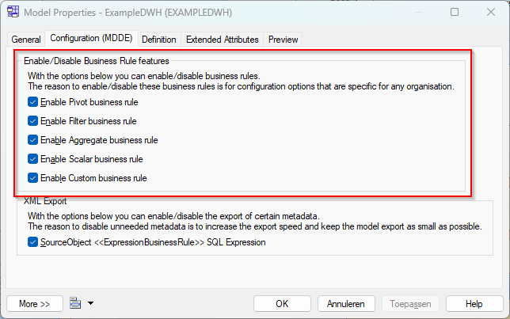
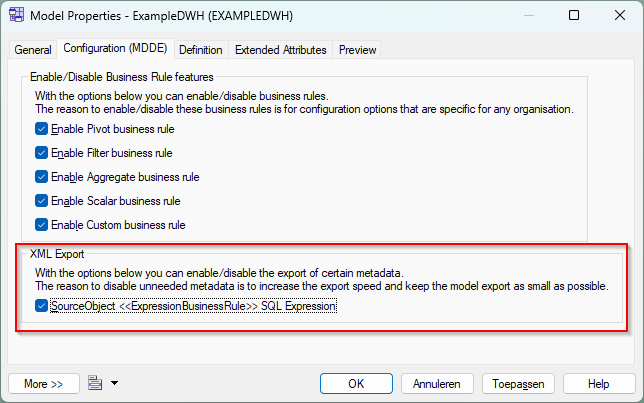

> [Manual](./README.md) > MDDE Model Configuration

# MDDE Model Configuration

This file describes all the possible configuration settings that can be changed at model level. These possibilities include enabling/disabling business rule features and a configuring the XML export of the MDDE extension.

> **Note**:
> These configuration properties are available on model level. You can access the configuration by right-clicking on the model, and click on 'Properties'. In the new dialog window go the the 'Configuration (MDDE)' tab.

## Enable/Disable Business Rule features

On the 'Configuration (MDDE)' tab there is the is a section named 'Enable/Disable Business Rule features' to specify which types of business rules are allowed in the model. The following business rules can be enabled/disabled:

- Pivot Business Rule
- Filter Business Rule
- Aggregate Business Rule
- Scalar Business Rule
- Custom Business Rule

See the explanation of the business rules [here.](./Business%20rule.md)

## XML Export

On the 'Configuration (MDDE)' tab there is the is a section named 'XML Export' where you can configure to include/exclude certain information in the XML Export. On this tab you can tick the boxes for the metadata which you want to include in the XML export.

> **Note**:
> It's adviced to only include information when needed, to keep the XML export as compact and fast as possible.

> **Note**:
> If you have multiple models and want to keep these settings in sync, it's adviced to create a model check for your project/organisation (in a project/organisation specific extension) to check and autofix these settings.

### Export options

The options are described in the table below.

| Option                                                   | Description                                                                                                                                         |
| -------------------------------------------------------- | --------------------------------------------------------------------------------------------------------------------------------------------------- |
| SourceObject `<<ExpressionBusinessRule>>` SQL Expression | Indicator whether to include the resolved SQL expression of expression business rules (like scalar and filter) in the XML export of source objects. |
