> [Manual](./README.md) > Mapping

# Mapping

In PowerDesigner, by default, you can create mappings with source entities for that mapping. Each source entity can only exists once in a mapping, which is a problem when you either want to join in a source table or apply one business rule multiple times within on mapping. Because of the latter the entity mapping (BaseClassifierMapping) and attribute mapping (BaseStructuralFeatureMapping) functionality is extended in PowerDesigner as part of this extension.

## Create a mapping

Creating a mapping is standard PowerDesigner functionality, where you can add a mapping on an entity. When you use the MDDE extension the standard functionality is extended and the mappings can be created on the 'Mapping (MDDE)' tab. A mapping is created click on the 'Add a mapping' icon on the right of the mapping list drop-down.

> If you don't see the 'Mapping (MDDE)' tab, click on the 'More >>' button in the bottom left of the entity dialog (the button is '<< Less' if the tab is already visible).

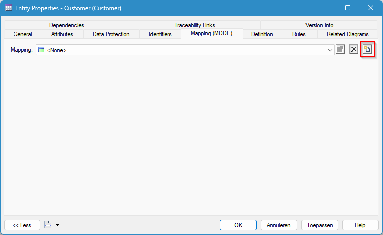

When you click on the button an object-picker screen will appear where you can select the data source (if there are multiple, otherwise it will automatically use the single existing one) and after selecting the data source it will ask to select the primary source object.

> **Note**:
> If mappings are also used for different purposes than MDDE modeling, be sure to set the stereotype on the relevant data sources to Data Source (MDDE). Mappings that serve a different purpose should be created using a data source that has a different (non-empty) stereotype. This way the 'Mapping (MDDE)' tabl will only display the MDDE mappings.

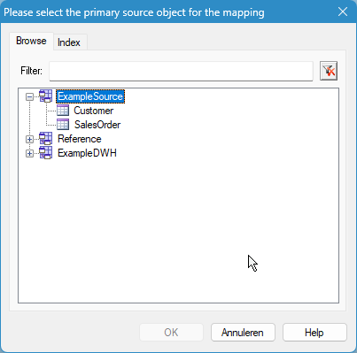

After adding the mapping you can go to it's properties by clicking the 'Properties' icon on the right of the drop-down list.

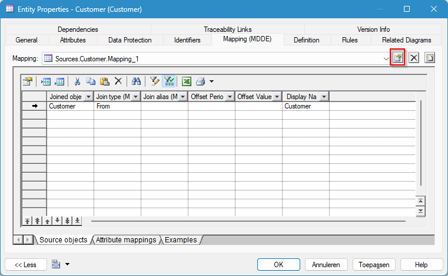

In the poperties tab you can set a good name for the new mapping in the 'Name' field of the mapping. 

After setting the name, click 'Apply' and 'OK'. Now you can read further in the next section to add source objects.

## Add a source object

In the mapping tab of an entity go to the 'Source objects' tab and then click on the 'Add a Row' button (or Ctrl+N). A new (empty) row in the list of source objects will be added.

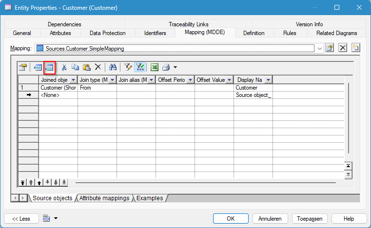

> Make sure the columns 'Joined object (MDDE)', 'Join type (MDDE)', 'Join alias (MDDE)' and 'Display Name' are visible. if time/validity is a factor that should be considered in joins also include 'Offset Period (MDDE)' and 'Offset Value (MDDE)'. You can configure column visibility using the 'Customize Columns and Filter' toolbar button.

First set the 'Joined object (MDDE)' by clicking on the dots (...) in the cell you want to edit.

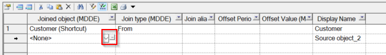

An object picker will appear with which you can select a source object. Choose the source object and click 'OK'. Now choose the corresponding 'Join type'. The primary source object for a mapping should always have the 'From' join type (which is automatically set so when you select the primary source object while creating the mapping). All other source objects should have one of the other join types (there can only be one 'From'). As a next option on the source object you can specify an alias, this is only needed if the same source object exists in the list of source objects multiple times. This is needed to enter the join properties in the next step specifying join conditions. 

When including time or validity in the join definition: The next option is to select the Offset Period for the source object if the data required is not for the current functional period. The offset period can be selected from the drop down menu. The next option Offset value is to specify how many periods to offset. For example, an offset period "Month"and value "-1" would get the previous month period.

Click 'Apply' to save the changes in the model.

### Specifying join conditions

When you added a source object with a join type which needs join conditions you must add these by opening the source object properties. 

You can do this by double-clicking on the number left of the source object you want to specify the join conditions on. A 'Source object Properties' screen should appear and the 'General' tab should be selected. On this tab the join conditions can be added/updated. The following properties per join condition need to be filled:

| Property               | Description                                                  |
|------------------------|--------------------------------------------------------------|
| Child attribute (MDDE)  | The attribute of the target object to join on                |
| Join operator (MDDE)    | The join operator to use (=, <>, <, >, >=, <=)               |
| Parent attribute (MDDE) | The attribute of a source object or literal value to join on |

Per cell use the dots button (...) to select the correct attribute. The parent attribute side can contain a reference to an attribute of another source object (by using the dots button) or a literal value (like number, date or textual value) by entering it in the cell. When you're done setting all values click 'Apply' and 'OK'.

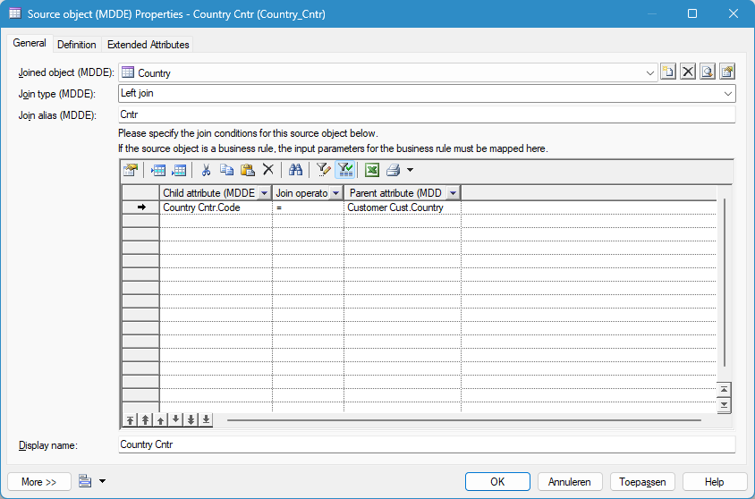

> Make sure the columns 'Child attribute (MDDE)', 'Join operator (MDDE)' and 'Parent attribute (MDDE)' are visible in this order. If not, you can add them using the 'Customize Columns and Filter' toolbar button.

### Add a scalar business rule

When you want to apply a scalar business rule in the mapping, you can add the scalar business rule as a source object, just like any other entity.

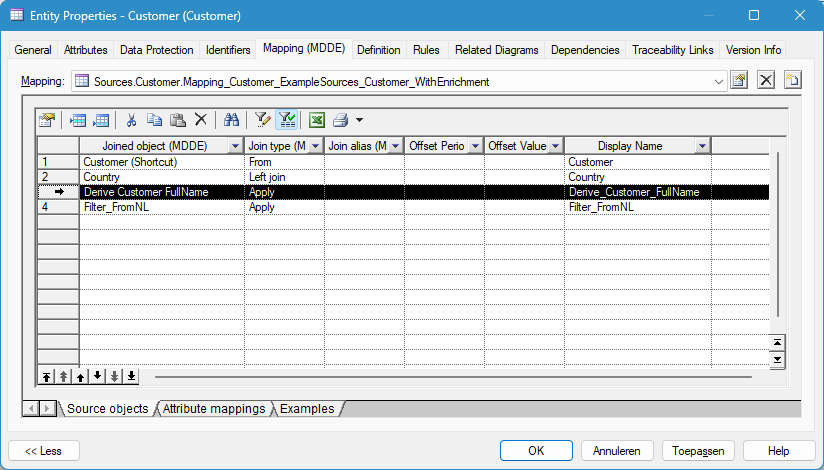

In order to specify how the input parameters are filled, we use the join conditions to specify per input attribute of the scalar business rule which attribute from another source object should go into the attribute. The input attribute can be an attribute from a source entity, but also an output attribute of a previously mapped business rule in the same mapping.

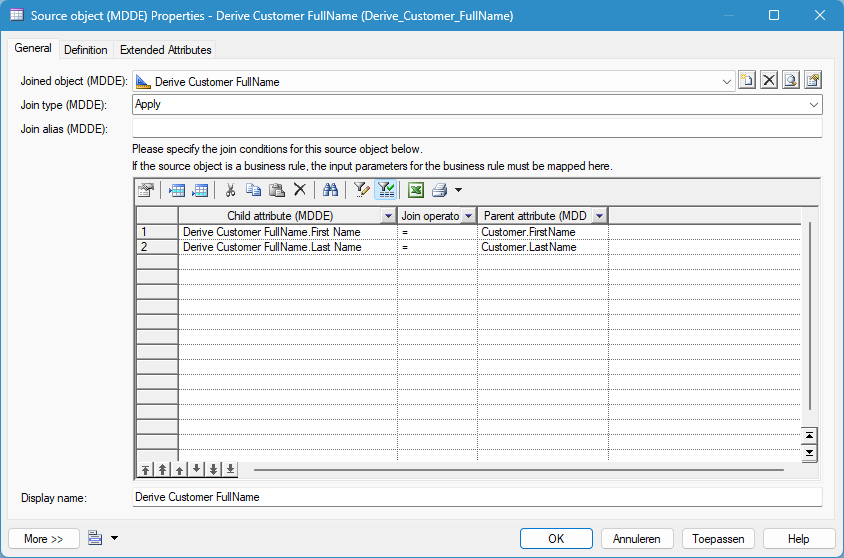

The output of the scalar business rule is mapped exactly like an attribute of any other source object, see the [Add an attribute mapping](#add-an-attribute-mapping) section for details on this.

### Add a filter business rule

When you want to apply a filter business rule in the mapping, you can add the filter business rule as a source object, just like any other entity.

In order to specify how the input parameters are filled, we use the join conditions to specify per input attribute of the filter business rule which attribute from another source object should go into the attribute. The input attribute can be an attribute from a source entity, but also an output attribute of a previously mapped business rule in the same mapping.

## Add an attribute mapping

To add attribute mapping, in the mapping (MDDE) tab of an entity, go the the 'Attribute mappings' tab.

> Make sure the columns 'Entity Attribute' and 'Source attribute (MDDE)' are visible (preferably in this order). If not, you can add them using the 'Customize Columns and Filter' toolbar button.

In this view you can now add a new attribute mapping using the 'Add Mapping' icon (blue square in screenshot below) in the toolbar to select one or more attributes from the target object. Now choose the target attribute(s) you want to specify the mapping for and click 'OK'. These attributes will now be added to the list of 'Attribute mappings'. Now for each target attribute you can specify the source in the 'Source attribute (MDDE)' field. You can either select a source attribute, an output attribute of a business rule or a static value (like a number, date, or textual value).
Another option is to use the "Create from sources" button (red square in screenshot below). Now in the popup you select fields from the source objects from the mapping. The attributes will be added to the target object and a mapping is created for these attributes. This last option is most usefull when the target object definition closely resembles the mapped sources since the target object attributes are created from source instead of adding them manually.

### Map a source or (business rule) output attribute

When you want to map a source attribute click on the [...] icon in the 'Source attribute (MDDE)' cell. This will open an object pick for the source object where you want to select an attribute from. When you select a source object and click 'OK' a second object picker will popup where you can select the source attribute. Select the attribute to use and click 'OK'. When you're done click 'Apply' to effectuate the changes in the model.

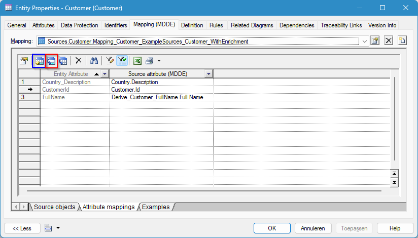

### Specify a literal value

When you don't source a value from an attribute, but you have a literal value for a certain target attribute you can type the value in the 'Source attribute (MDDE)' field. When it's not a numeric value you have to encapsulate the value in single quotes ('). When you're done click 'Apply' to effectuate the changes in the model.

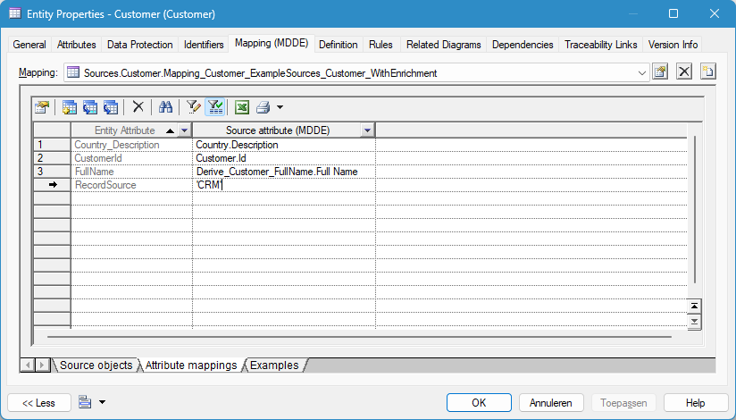

## Examples

As part of creating a mapping it's important to also include examples. An example contains the expected output given an example input for the source objects of the mapping. To model an example following the following steps:

On the 'Mapping (MDDE)' tab:
1. Choose the mapping to create an example for.
1. Go to the 'Examples' tab in the bottom of the screen. This will show a list of all examples.
1. Create a new example by clicking the 'Add a Row' button (or press CTRL+I).
1. Enter the name of the example in the 'Name' field, describe the example in the comment field and press 'Apply'.

   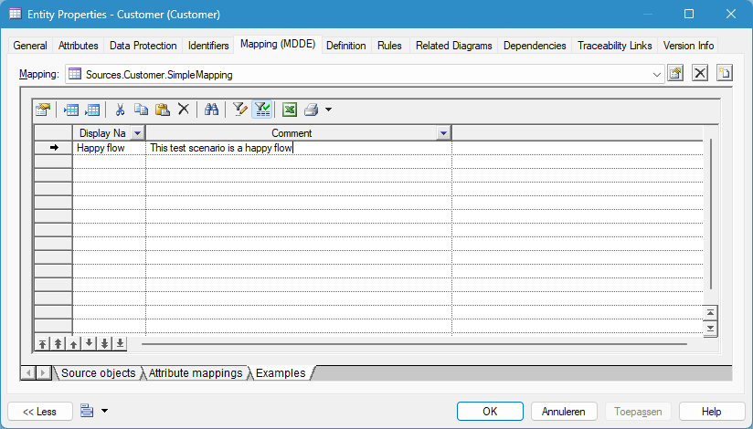

1. Double click on the new example row (in the grey area on the left) to open the example.
   In the new dialog screen you will see the name, the comment and example data for the example.
   The example data is the source input and expected output data. The type of the example data can be read in the 'Example data type (MDDE)'. The expected output data will always be for the target entity of the mapping and the source input for any source entity of the mapping.
   The number of records specified per entity can be read in the 'Example record count (MDDE)' attribute.

The example data for the target entity is automatically created. The expected output records can be specified by opening the expected output example data (double click on the grey areay). Read the instructions in the [Specify example data records](#specify-example-data-records) on how to specify the expected output records.

### Add example input data
In the 'Example (MDDE) properties' screen:

1. Add example input data for a specific entity by clicking on the 'Add a Row' button (or press CTRL+I).
1. Specify the example entity by clicking on the dots (...) button in the 'Example entity (MDDE)' field and press 'Apply' after choosing an entity.

   

1. Open the example input by double clicking on the new example data row (in the grey area).

### Specify example data records
To specify example data records (either for source input or expected output), double click on the grey area of the example data in the 'Example (MDDE) Properties' window.

1. In the new dialog screen on the 'General' tab you can add example records for clicking 'Add a Row'.
1. Set the name of the example record so it's clear what the row functionally resembles (if possible) and press 'Apply'.

   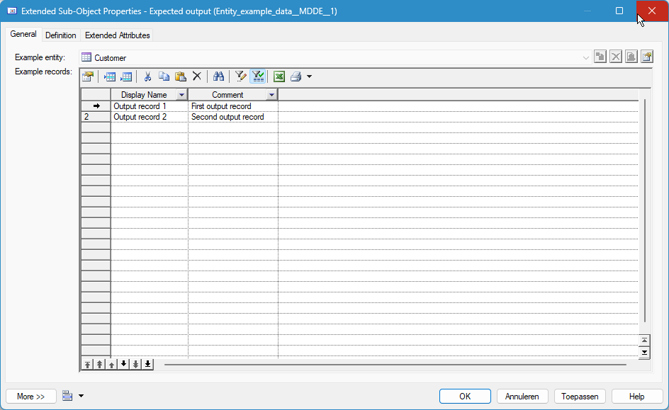

1. Double click on the new example record row (in the grey area) to open it.
   Thew new dialog screen shows all attributes ('Attribute (MDDE)') with values ('Value (MDDE)') for the example record.
1. Add a new attribute value by click on the 'Add a Row' button.
1. Set the attribute the example is for by clicking on the dots (...) button in the 'Attribute (MDDE)' field.
1. Set the value for the current attribute in the 'Value (MDDE)' field.
1. Repeat the previous 3 steps for each attribute.
1. Press 'Apply' to store the attribute values.

   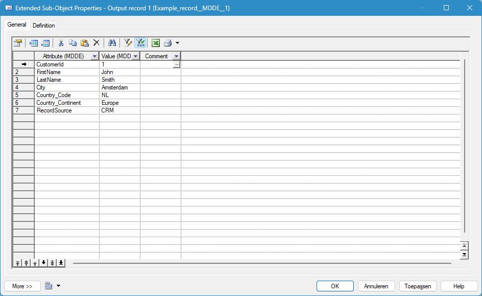

> Make sure for all example records within an example data set (input or output) (as created in the 'Example data' section) the same attributes are used. So if in the first record for 3 attributes example values are given, make sure for the other records for the same attributes example values are given.

A complete example should contain expected input and output records as shown below:

When you want to create multiple examples, follow the the above steps for every example.

***

[Go back to main modeling page](./README.md)