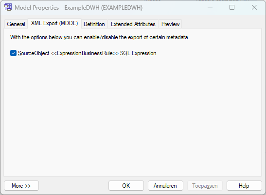

> [Manual](./README.md) > Configure the XML export

# Model Export Configuration

The XML export of from the MDDE extension can be configured to include/exclude certain information. These configuration properties are available on model level. You can access the configuration by right-clicking on the model, and click on 'Properties'. In the new dialog window go the the 'XML Export (MDDE)' tab.

On this tab you can tick the boxes for the metadata which you want to include in the XML export.

## Export options
The options are described in the table below.

| Option                                                 | Description |
|---                                                     |---          |
| SourceObject <<ExpressionBusinessRule>> SQL Expression | Indicator whether to include the resolved SQL expression of expression business rules (like scalar and filter) in the XML export of source objects. |