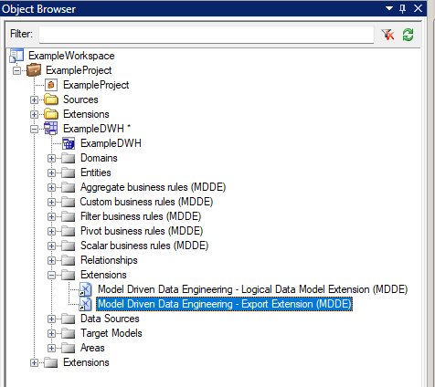
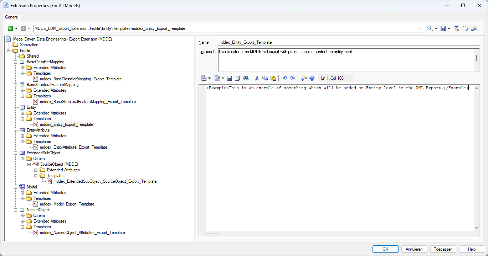

> [Manual](./README.md) > Customize the XML export

# MDDE Model Export Extension

Attach the MDDE LDM Export Extension to the model and open the extension editor

> **Note**:
> Consult the [SAP PowerDesigner documentation](https://help.sap.com/docs/SAP_POWERDESIGNER/31c48596e34446a68956e0aa7e700a2e/c7e1ddda6e1b101482c096290e45387b.html) for more information about attaching extension to a model.

In the editor, expand the profile section in the left panel to navigate through the available metaclasses that are configured for customization. Each metaclass contains a template that can be used to include specific content to the XML Export. Initially all templates are empty since they should only contain customer/project specific additions to the MDDE LDM extension.

The example shows a fixed xml text that is included in all objects of PowerDesigner metaclass Entity (MDDE entities, MDDE business rules). It is also possible to add custom extended attributes or content from a different extension.

> **Note**:
> Consult the [SAP PowerDesigner documentation](https://help.sap.com/docs/SAP_POWERDESIGNER/31c48596e34446a68956e0aa7e700a2e/c7d31d216e1b1014ab88822700700793.html) for more information about working with extensions. Instructions on working with GTL templates can be found in [this section](https://help.sap.com/docs/SAP_POWERDESIGNER/31c48596e34446a68956e0aa7e700a2e/c7d455d56e1b1014b2d09c0c6adc50fa.html). Formatting options are described in [this section](https://help.sap.com/docs/SAP_POWERDESIGNER/31c48596e34446a68956e0aa7e700a2e/c7d47e266e1b1014bed1d75ce550a7dc.html). 

The resulting XML with this example would be (only showing fragment with relevant changes):

Be aware that changes that are done in the model export extension will apply to all models that have this particular instance of the extension attached. It is possible to use different variations of the model export extension for different models by saving them in different locations.

[Go back to main modeling page](./README.md)
