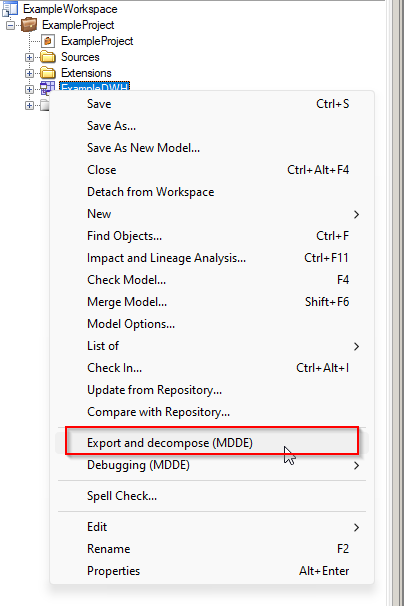

> [Manual](./README.md) > PowerDeComposer

# PowerDeComposer

In order to save the results of the changes made in the PowerDesigner models you can right-click on a model and click on 'Export XML and Decompose (MDDE)' to export the model to an XML file for code generation and decompose the model so it's ready to be pushed into Git.

> This needs to PowerDesigner named paths to be setup correctly. See the [README](../README.md) in the root folder.

> After exporting and decomposing the model it can happen PowerDesigner shows there are still unsaved changes. When this happens all changes are stored in the export and decomposed model, so don't worry in this case something was not exported. This is a known issue where we haven't found a fix for yet, there are actually no unsaved changes.

***

[Go back to main modeling page](./README.md)