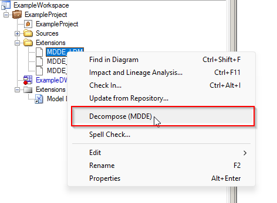

> [Manual](./README.md) > Project extension

# Project Extension

When you are working with multiple models for a data product it can be helpfull to group these models into a "Project" model. A project can contain multiple models organized into a folder structure (only visually in the PowerDesigner workspace). For more information using projects, please consult the [PowerDesigner documentation](https://help.sap.com/docs/SAP_POWERDESIGNER/abd3434b4987485c92057ab9392aadbe/c7db7e5c6e1b10148a38c1ad75beaa04.html?locale=en-US).

## Attaching the project extension

To start using the project extension, it must be attachted to the project. Attach the MDDE Project Extension to the project by opening the project diagram and in the main menu go to "Model" > "Extensions".

> **Note**:
> Consult the [SAP PowerDesigner documentation](https://help.sap.com/docs/SAP_POWERDESIGNER/31c48596e34446a68956e0aa7e700a2e/c7e1ddda6e1b101482c096290e45387b.html) for more information about attaching extension to a model.

## Using the project extension

When the project extension is attached new menu items will appear in the context menu of certain object types.This is described below per object type.

### Project / folder

On the main project and any subfolder the followng menu items appear:

- Open all logical data models (MDDE)
  - Opens all models in the project or folder (and any subfolder).
- Export and decompose open logical data models (MDDE)
  - Executes the export of XML and decompose methods on all open LDM models in the selected project or folder (and any subfolder).

### Extension file

If you add an extension file reference to the project (or any subfolder) the following menu items are added by the project extension:

- Decompose (MDDE)
  - This will decompose the extension file.

